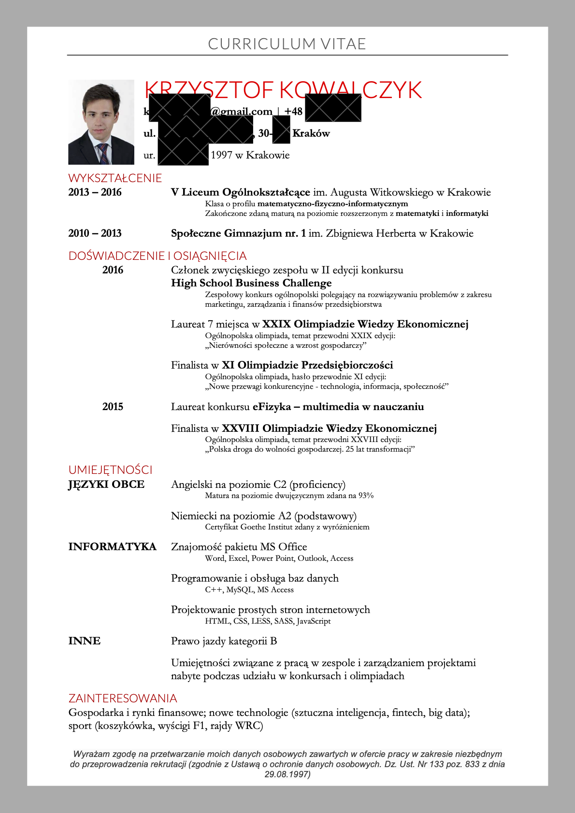
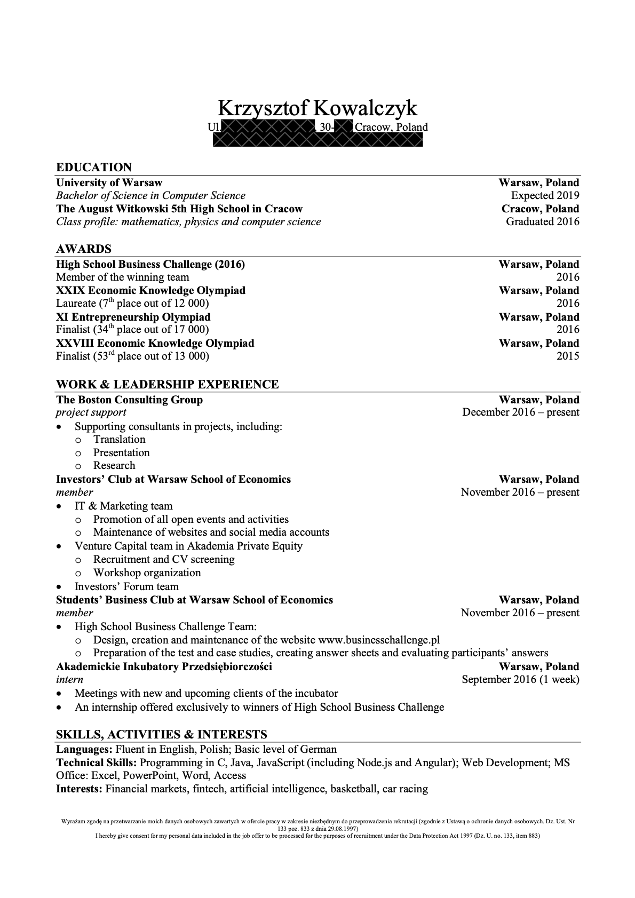
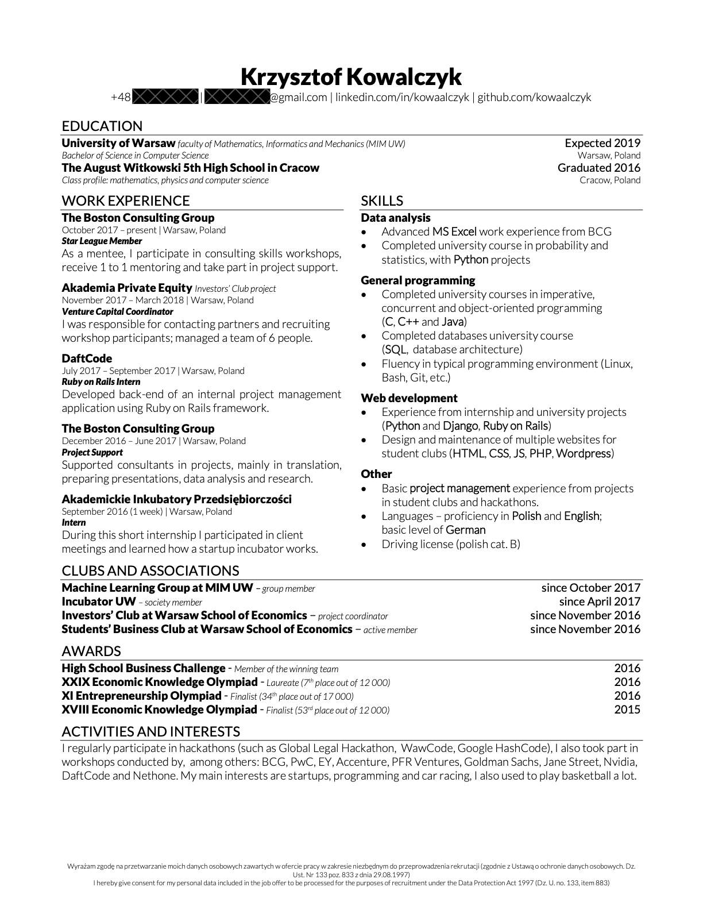
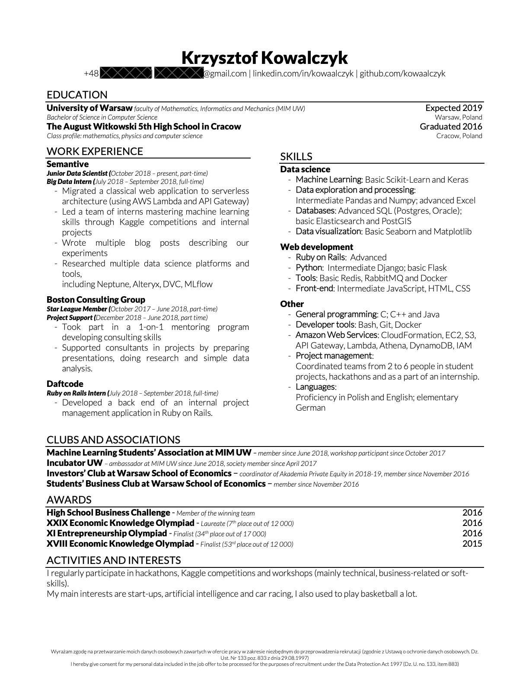
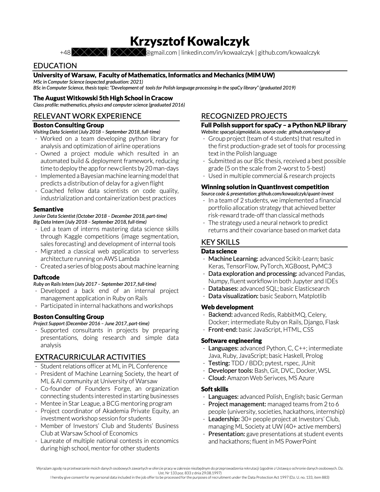
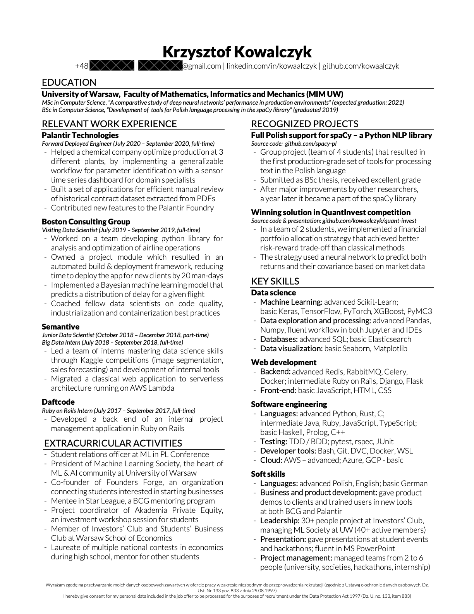
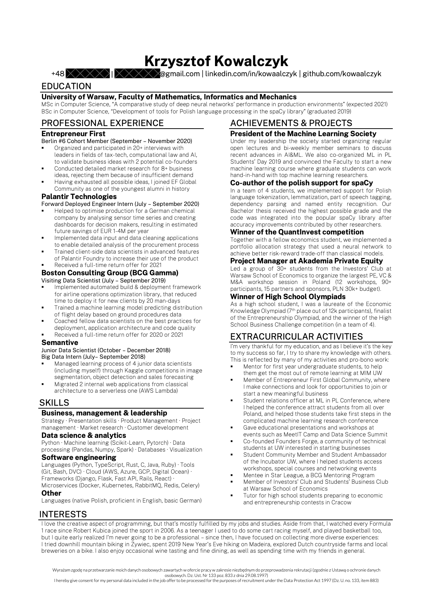

# Jak napisać dobre CV

Wiele osób popełnia błędy podczas pisania CV które utrudniają im znalezienie najlepszych
okazji. W internecie łatwo jest znaleźć wiele stron z zasadami które warto przestrzegać.
Podstawowe z nich to [[1]](https://www.thinkful.com/blog/tech-resume/):

- ogranicz CV do jednej strony A4
- pisz proste zdania w punktach, unikaj bloków tekstu i złożonych zdań
- stawiaj na prostotę (brak zdjęć, grafik, niestandardowego układu strony)
- zadbaj o poprawną gramatykę (najlepiej pisać po angielsku i używać narzędzi typu
  grammarly do sprawdzania poprawności)
- przedstaw swoje osiągnięcia w mierzalny sposób (_x-y-z formula_)
- wysyłaj CV zawierające tylko doświadczenia które mogą być przydatne w docelowej roli

## Przykłady moich CV i tego co mogłem zrobić lepiej

Zanim przejdę do bardziej konkretnej listy co robić / czego nie robić, warto przejrzeć
kilka przykładów żeby wszystko wydawało się bardziej oczywiste 🙂

### Pierwsze CV

Moje pierwsze CV (2016, w czasie 1 roku studiów kiedy aplikowałem na staże w małych
firmach progamistycznych) napisałem nie znając większości porad które tutaj udostępniam:

Co można tu poprawić:

- zdjęcie jest kompletnie niepotrzebne, w niektórych krajach i firmach może nas nawet
  zdyskwalifikować [[2]](https://graduateland.com/article/profile-picture-cv)
- jest dużo pustego miejsca i mało szczegółów nt edukacji (np. brakuje studiów i
  przedmiotów, wypisanie ich mogłoby znacząco zwiększyć moje szanse)
- kolorowe cv może źle się drukować na czarno-białych drukarkach (ludzie używają papieru
  częściej niż się wydaje żeby notować sobie rzeczy bezpośrednio na CV kandydata)
- dużo niepotrzebnego szumu, np. napis "CURRICULUM VITAE" jest kompletnie niepotrzebny,
  podobnie jak adres zamieszkania i data urodzenia
- brak linków do stron związanych z osiągnięciami / projektami
- CV w języku polskim nie ma sensu (zakładając że aplikuje się też do międzynarodowych
  firm), bo utrzymywanie polskiego i angielskiego CV jest zbyt czasochłonne

Z tym CV aplikowałem do kilku(nastu?) lokalnych firm w Warszawie, od wiekszości odbiłem
się od razu - jest to normalne. Jedna zaprosiła mnie na rozmowę ale podziękowała
później, natomiast Daftcode postanowił dać mi szanse (z tym CV + ukończonymi warsztatami
z Ruby-on-Rails które prowadzili w czasie semestru). Tak dostałem się na pierwszy staż.

### Drugie CV

Drugie CV napisałem w 2017, żeby po 1 roku aplikować na różne bardziej biznesowe
wydarzenia (warsztaty itp). Wtedy nie wiedziałem jeszcze czy chcę w ogóle pracować jako
programista i chodziłem na dużo różnych wydarzeń z innych branż (bankowość inwestycyjna,
consulting, venture capital, private equity). Myślałem o stażach gdzie moje
programistyczne / matematyczne zdolności mogłyby być przydatne ale niekoniecznie
wymagane i tak wyglądało CV którego używałem przy takich okazjach:

Ważne zmiany w stosunku do poprzedniego to:

- jest znacznie prostsze i łatwiejsze do utrzymywania, podobnego formatu trzymam się aż
  do teraz, oryginalne źródło szablonu to
  [Investment Banking CV Template](https://www.wallstreetoasis.com/forums/investment-banking-resume-template)
  które polecili mi znajomi z Klubu Inwestora SGH
- liczby w nagrodach potwierdzają prestiż tych osiągnięć i pozwalają je porównywać
- czarno-białe CV bez zdjęcia jest znacznie bardziej przyjazne dla drukarek
- extracurricular activities które są wymienione jako doświadczenie to bardzo fajny
  sposób żeby cv było pełne (one też lepiej podkreślają umiejętności biznesowe niż sama
  lista umiejętności)
- zmieniona kolejność: rzeczy które są związane z tym na co aplikowałem są na górze
  (mało o studiach, dużo o biznesie - olimpiadach i kołach naukowych)

Oczywiście to nie jest CV które wysłałbym do jakiejkolwiek programistycznej firmy.

Ponadto, wciąż brakuje tu kilku rzeczy:

- w osiągnięciach i extracurricular activities brakuje "so what" - nie wspominam ani o
  tym dlaczego robiłem to co robiłem, ani jakie były tego końcowe efekty (co zostało
  osiągnięte, czego się nauczyłem, itd.)
- umiejętności nie są do końca aktualne (w szczególności brakuje Ruby-on-Rails, w którym
  w zasadzie czułem się wtedy najpewniej jako developer)

### Trzecie CV

Przed wakacjami w 2018 (po 2 roku studiów) nasłuchałem się dużo nt. tego jak data
science i analityka ogólnie jest idealnym połączeniem zainteresowania biznesem z
umiejętnościami programistycznymi, chciałem więc zdobyć pierwsze doświadczenia w tym
kierunku. W tym celu aplikowałem na programistyczne staże po raz kolejny - tym razem z
takim CV:

Ważne zmiany:

- łatwo widoczne umiejętności, na równi z doświadczeniem (jest to znacznie ważniejsza
  zmiana niż się wydaje, ponieważ przeciętne CV jest oglądane przez ≤10s i rekruter
  nigdy nie rzuci okiem na coś co nie jest w górnych 2/3 strony - na typowym komputerze
  po otwarciu typowego PDF-a ta część nie jest nawet wyświetlana)
- link do githuba i linkedin zamiast adresu (znacznie bardziej pożyteczne dla
  rekruterów)
- linki (email, linkedin, github) są klikalne w oryginalnym CV (zaznaczam bo na stronie
  tego widać, jest ono wyświetlone jako zdjęcie)
- w zasadzie wszystkie biznesowe rzeczy z poprzednieg cv trafiły na sam dół jako
  zainteresowania (bo w tym kontekście to nie było dużo więcej)
- zamiast wymieniania wszystkich kół naukowych jako doświadczenie, zostawiłem tam jedyny
  projekt którym zarządzałem (żeby pokazać że mam ambicje managerskie / basic skille
  wystarczające żeby za parę lat zostać dobrym technical managerem)

To wciąż można było poprawić:

- dając więcej info nt kursów ze studiów (aczkolwiek moja średnia była wtedy tragiczna
  (ok. 3.2) i nie chciałem tego podkreślać)
- niektóre nazwy technologii są pogrubione żeby je zaznaczyć, ale to nie wygląda ładnie

Tym razem aplikowałem na bardzo wiele pozycji (jakieś 20-30) ale odpowiedź dostałem
tylko od 3-5. Ostatecznie byłem na kilku rozmowach i dostałem oferty od startupu Cosmose
(gdzie miałbym pisać aplikację w zespole z innymi studentami z MIMu) i Semantive (gdzie
miałem dołączyć do zespołu internów uczących się data science pod okiem bardziej
doświadczonych pracowników). Ta druga opcja była dokładnie tym czego potrzebowałem, i
dostałem ją przede wszystkim dzięki temu że wymieniłem _basic project management_
którego nauczyłem się podczas projektów na SGH - przekonało to założycieli firmy że mogę
wnieść do zespołu bardziej analitycznych ludzi jakieś zdolności organizacji pracy i
praktyczne myślenie o tym co pożytecznego możemy zrobić. W ten sposób udało mi się
skierować na ścieżkę kariery na której jestem obecnie, bo bardzo mi się podoba to co
robię od tamtego czasu.

### Kolejne CV

Kolejne CV są już bardzo podobne, jednak wciąż to na co zwracałem uwagę to ciągłe
ulepszanie tego, w jaki sposób komunikuję swoje umiejętności i osiągnięcia - zwięźle,
ale tak żeby przekazać wszystkie ważne rzeczy. Używałem tego samego szablonu,
aktualizując go tylko o nowe doświadczenia i poprawiając istniejące opisy - w ten sposób
nie musiałem nigdy spędzać na tym dużo czasu.

Po stażu w Semantive próbowałem pracować part-time w czasie semetru, jednak nie wyszło
mi to na dobre i po 3 miesiącach musiałem to skończyć. Na kolejny staż aplikowałem do
BCG, firmy której znałem dobrze dzięki wcześniejszym doświadczeniom (program
mentoringowy, student support i olimpiada).

Widać tu nowe zmiany w doświadczeniu, jednak formatowanie z jakiegoś powodu wydaje się
bardzo dziwne (szczerze mówiąc nie jestem przekonany że to dokładnie ta wersja którą
wysłałem).

Mając świetną ofertę z BCG (gdzie bardzo mi się podobało i byłem dobrze wynagradzany)
pomyślałem że jedyną firmą w której może potencjalnie być ciekawiej jest Palantir
(znajomy opowiedział mi dużo nt swoich doświadczeń i wydawało się to podobne do tego co
robiłem w BCG, jednak bardziej nastawione na budowanie produktu niż na świadczenie
jednorazowych usług). Aplikowałem więc tam, oraz na _Assosciate Product Manager Intern_
do Google, gdzie jednak odbiłem się na ostanim etapie, z takim CV:

Tutaj widać już znaczące poprawy:

- każdy punkt doświadczenia zawiera info o tym jaka była jego wartość dla firmy lub
  czego się nauczyłem
- wszystkie studenckie doświadczenia wylądowały na dole, bo mam już wystarczająco tych
  prawdziwych
- umiejętności są drugorzędne, znacznie ważniejsze jest podkreślenie projektów (actions
  speak louder than words), każdy z projektów zawiera link do demonstracji /
  repozytorium kodu a jego opis podkreśla jakimi umiejętnościami wykazałem się w trakcie

Przed stażem w Palantirze rozpoczęła się pandemia koronawirusa, dzięki której udało mi
się zapisać w marcu na znacznie więcej przedmiotów i zaliczyć je wszystkie korzystając z
tego że wszystko działo się zdalnie (konflikty w wykładach nie były problemem bo
wszystko było nagrywane, ponadto większośc przedmiotów można było zaliczyć samymi
projektami bez egzaminów, co bardzo faworyzuje samoorganizujące się osoby takie jak ja).

Mając zaliczone prawie wszystkie przedmioty oraz oferty powrotu po studiach od Palantira
i BCG, postanowiłem spróbować założyć własny biznes. W tym celu aplikowałem do
Entrepreneur First z takim CV, które bardzo im się spodobało i w efekcie zostałem
przyjęty:

Pomimo tego że nie udało mi się założyć tam start-upu, wciąż eksperymentuję z kilkoma
projektami oraz od czasu do czasu rozmawiam z headhunterami którzy szukają osób o moim
profilu. Obecnie posługuję się takim CV:

Jest ono dobre, ale problemem jest zbyt dużo tekstu - pokazuje to że o ile z biegiem
czasu coraz łatiwej dostawać coraz ciekawsze oferty, problemy z CV pozostają te same 🙂

## Dodatkowe rady

Teraz polecam przeczytać trochę tipów dotyczących jak napisać CV i napisać swoje:

- ogólny poradnik z przykładami, w szczególności opisujący pisanie pierwszego cv:
  [link](https://novoresume.com/career-blog/resume-advice-for-students-with-no-experience)
  - pokazując umiejętności, nie warto używać skali bardziej precyzyjnej niż 1-5 (ja
    osobiście nie używam 1-3 jeśli muszę, ale najczęściej żadnej)
- kolejny ogólny poradnik, tym razem dedykowany dla developerów:
  [link](https://stackoverflow.blog/2020/11/25/how-to-write-an-effective-developer-resume-advice-from-a-hiring-manager/)
- jak opisywać swoje doświadczenia (kiedy jest się trochę bardziej doświadczonym):
  [link](https://www.inc.com/bill-murphy-jr/google-recruiters-say-these-5-resume-tips-including-x-y-z-formula-will-improve-your-odds-of-getting-hired-at-google.html)
- dla większości ludzi word / google docs jest prostszy w użyciu niż latex (nawet
  używając overleafa)
  - tutaj jest mój ulubiony template do worda:
    [link](https://www.mergersandinquisitions.com/free-investment-banking-resume-template/)
    (raczej nie będzie działał w google docs)
  - fajną alternatywą do zrobienia na szybko może być generator:
    [https://jsonresume.org/](https://jsonresume.org/)
  - cv tak czy inaczej zawsze eksportujemy do pdf i wysyłamy w takiej formie
- przed wysłaniem spytaj się kogoś bardziej doświadczonego (np. mnie) o sprawdzenie czy
  jest git i sprawdź poprawność tego co piszesz za pomocą narzędzia typu grammarly
- jeśli utrzymujesz kilka wersji cv (ja np. zanim znalazłem swoją niszę w data science
  robiłem jedno pod consulting / finance, drugie pod software) warto trzymać jeden plik
  z opisami wszystkich doświadczeń, technologii, itp, i tylko kopiować potrzebne żeczy
  przy przygotowaniu konkretnego cv
- ogólnie jedno cv wystarczy jeśli aplikujesz na podobne role (nie trzeba go
  customizować pod konkretne firmy), natomiast jeśli firma wymaga cover letter to
  koniecznie trzeba napisać coś specjalnie pod nią
- żeby szybko pisać CV (i inne tego typu rzeczy które nie są najbardziej naturalne)
  najlepszą metodą jest pisanie jak najięcej bez zastanowienia i poprawianie lub
  przepisywanie potem tego co się napisało - większość osób które znam spędza nad
  pisaniem bardzo długo bo za dużo myśli, znacznie łatwiej jest napisać byle co i
  poprawiać dopóki nie uzyska się satysfakcjonującego wyniku
